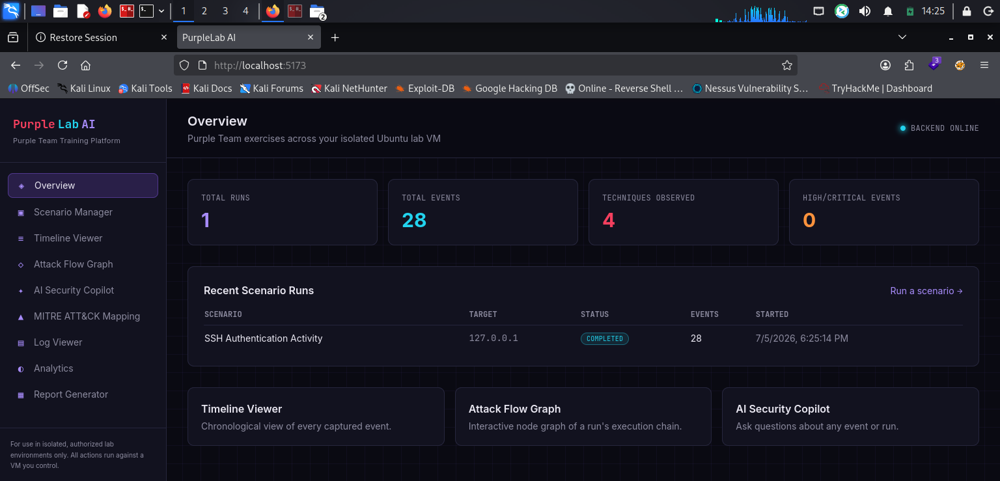
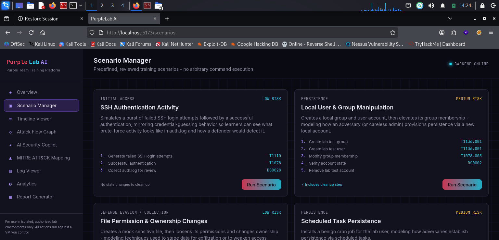
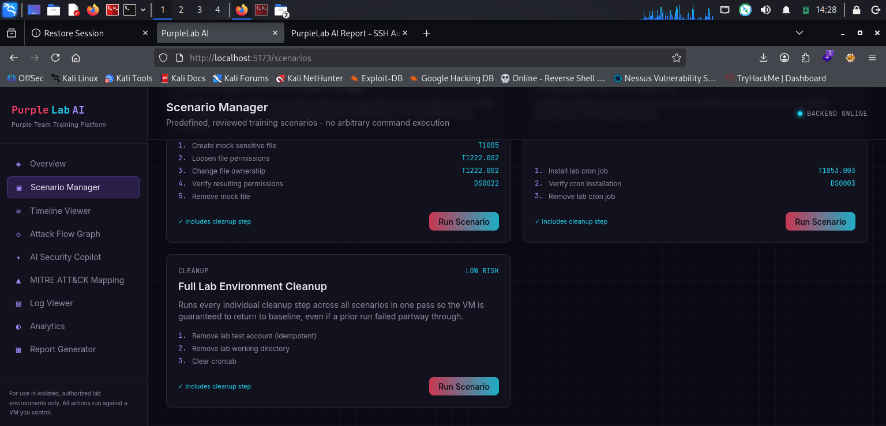
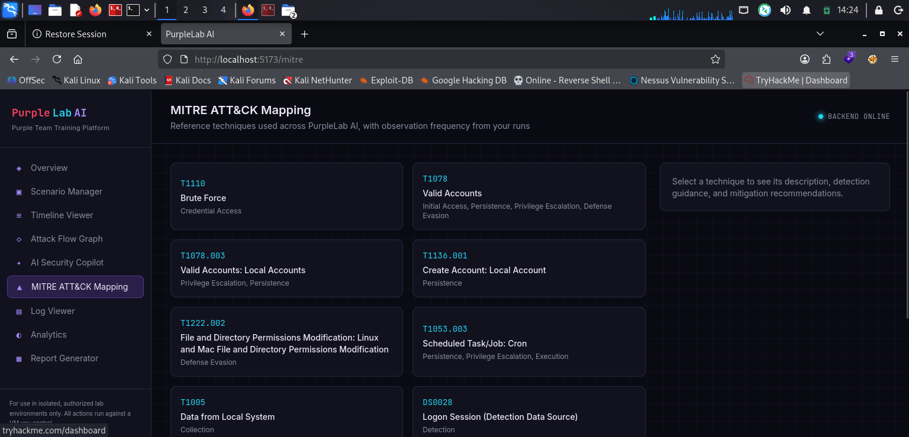
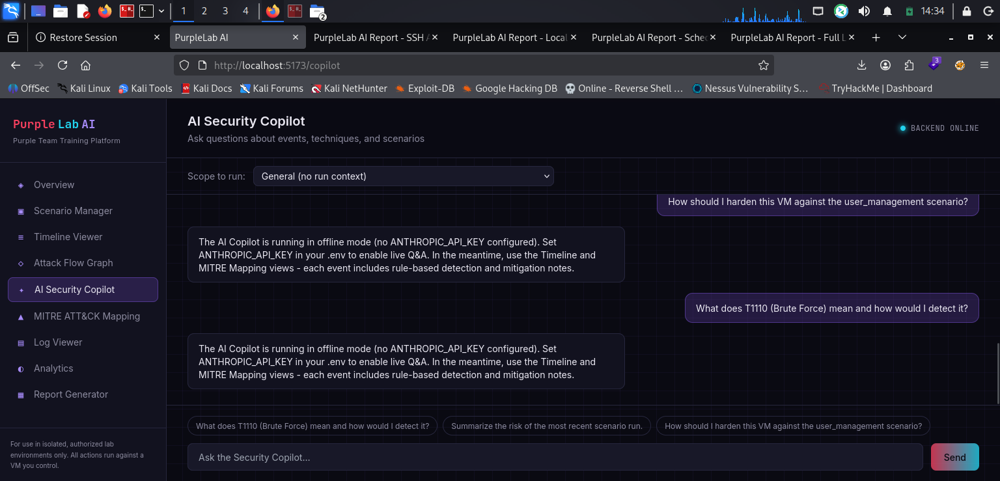

<div align="center">
# 🟣 PurpleLab AI
**An educational Purple Team cybersecurity platform for authorized, isolated virtual lab environments.**


</div>
---

## 🔎 What is PurpleLab AI?

PurpleLab AI drives predefined, reviewed training scenarios — SSH authentication
activity, local user/group management, file permission changes, and scheduled
task persistence — over SSH against a lab VM. It then collects the resulting
logs, reconstructs a chronological timeline, maps every action to **MITRE
ATT&CK**, generates AI-assisted explanations with detection and mitigation
guidance, and renders an interactive attack-flow graph. The goal: see both the
attacker's actions and the defender's visibility into them, side by side, in a
sandbox you fully control.

It's built for **learning, portfolio projects, and interview prep** — not for
use against systems you don't own.

> ⚠️ **Scope & safety.** PurpleLab AI does **not** provide arbitrary remote
> command execution. Every command it can send over SSH is a fixed string
> defined in `backend/app/scenarios/definitions.py` and enforced by an
> allow-list in `backend/app/core/ssh_client.py`. The SSH client also refuses
> to connect to any host that isn't explicitly listed in `ALLOWED_LAB_HOSTS`.
> Only point this at a machine you own, on an isolated lab network.

---

## 📌 Current status: Kali-only lab (dual-VM was the original plan)

This project was **designed** around two machines — a Kali box running the
app, SSHing out to a separate Ubuntu VM as the target. That's still the
target architecture and how the code is written.

The **build that's actually running and validated right now** is a
single Kali Linux VM doing both jobs: it hosts the app *and* the SSH target,
talking to itself over `127.0.0.1`. This was a deliberate call after hitting
RAM limits running two VMs on an 8GB laptop side-by-side.

| | Planned | Current |
|---|---|---|
| Machines | Kali (attacker/control) + Ubuntu (target) | Kali only |
| SSH target | Ubuntu VM's LAN/NAT-Network IP | `127.0.0.1` (loopback) |
| Code changes required | — | **None** — it's two lines in `.env` |
| Status | 🔜 Roadmap | ✅ Working, validated end-to-end |

The app has no idea which topology it's running in — `LAB_VM_HOST` is just a
hostname the SSH client connects to. Both setups are documented below: the
[Quick Start](#-quick-start-current-setup-kali-only) covers what's running
today, and [Two-VM Setup](#-optional-two-vm-setup-original-planned-architecture)
covers reconnecting the original design whenever a second machine (or more
RAM) is available.

---

## 🖼️ Screenshots

<table>
<tr>
<td width="50%">

**Overview Dashboard**

Live run count, event totals, techniques observed, and recent scenario runs
against the loopback lab target.

</td>
<td width="50%">

**Scenario Manager**

Predefined scenarios with their steps and MITRE technique IDs shown
up front, before you run anything.

</td>
</tr>
<tr>
<td width="50%">

**Scenario Manager — cleanup scenarios**

Every state-changing scenario ships its own cleanup step, plus a standalone
Full Lab Environment Cleanup as a safety net.

</td>
<td width="50%">

**MITRE ATT&CK Mapping**

Reference technique library — tactic, technique ID, and description for
every technique the platform can surface.

</td>
</tr>
</table>

**AI Security Copilot**

Shown here running in **offline rule-based fallback mode** — no
`ANTHROPIC_API_KEY` configured yet. This is intentional graceful degradation,
not a bug: every feature works with zero external API calls, and switches to
live AI-generated answers the moment a key is added to `.env`.

---

## Table of contents

- [Feature overview](#-feature-overview)
- [Architecture](#-architecture)
- [Project structure](#-project-structure)
- [Quick Start — current setup (Kali-only)](#-quick-start-current-setup-kali-only)
- [Optional: two-VM setup (original / planned architecture)](#-optional-two-vm-setup-original-planned-architecture)
- [Using PurpleLab AI](#-using-purplelab-ai)
- [Predefined scenarios](#-predefined-scenarios)
- [Safety model](#-safety-model)
- [Configuration reference](#-configuration-reference)
- [Compatibility notes](#-compatibility-notes-python-313--kali)
- [Troubleshooting](#-troubleshooting)
- [Roadmap](#-roadmap)

---

## ⚙️ Feature overview

| Module | What it does |
|---|---|
| **Scenario Manager** | Browse and launch predefined training scenarios; each shows its steps and MITRE mapping before you run it. |
| **Timeline Viewer** | Chronological reconstruction of a run, laid out on a central "duality spine" — attacker-simulated actions on one side, defender/log activity on the other. |
| **Interactive Attack Flow Graph** | React Flow graph of a run's execution chain: draggable, zoomable nodes colored by severity, edges labeled with MITRE tactics. |
| **AI Security Copilot** | Chat interface to ask questions about any event, technique, or run; falls back to rule-based answers if no AI API key is configured. |
| **MITRE ATT&CK Mapping** | Reference library of techniques used by the platform, with a heatmap of how often each has actually been observed in your runs. |
| **Log Viewer** | Raw, parsed log lines pulled from the lab target (`auth.log`, `syslog`), filterable by run and source. |
| **Analytics Dashboard** | Chart.js visualizations: severity distribution, events by MITRE tactic, runs by scenario. |
| **HTML/PDF Report Generator** | Exports a run — timeline, MITRE mapping, AI analysis — as a shareable HTML or PDF report. |

---

## 🏗️ Architecture

### Target architecture (planned, two-VM lab)

```
┌───────────────────── Kali Linux (attacker / control) ─────────────────────┐
│                                                                             │
│   ┌─────────────────────────────┐        ┌──────────────────────────┐     │
│   │        React Frontend       │  HTTP  │      FastAPI Backend     │     │
│   │  (Vite, Tailwind, React     │◄──────►│                          │     │
│   │   Flow, Chart.js)           │  /api  │  routers/  scenarios,    │     │
│   │                             │        │  events, mitre, copilot, │     │
│   │  Scenario Manager           │        │  reports, analytics      │     │
│   │  Timeline Viewer            │        │                          │     │
│   │  Attack Flow Graph          │        │  core/                  │     │
│   │  AI Security Copilot        │        │   ssh_client.py          │     │
│   │  MITRE Mapping              │        │   scenario_engine.py     │     │
│   │  Log Viewer                 │        │   log_collector.py       │     │
│   │  Analytics                  │        │   mitre_mapper.py        │     │
│   │  Report Generator           │        │   ai_copilot.py           │     │
│   └─────────────────────────────┘        │   report_generator.py    │     │
│                                            │                          │     │
│                                            │  scenarios/definitions.py│     │
│                                            │  SQLite (runs, events,   │     │
│                                            │          reports)         │     │
│                                            └────────────┬─────────────┘     │
│                                                          │ SSH (Paramiko)   │
└──────────────────────────────────────────────────────────┼──────────────────┘
                                                            │
                                              NAT Network / Host-only
                                                            │
                                                            ▼
                                       ┌──────────────────────────────────┐
                                       │   Ubuntu Lab VM (isolated)       │
                                       │   auth.log · syslog · cron       │
                                       │   labadmin (scoped sudo)         │
                                       └──────────────────────────────────┘
```

### Current deployment (validated, Kali-only)

```
┌────────────────────────────── Kali Linux (single VM) ──────────────────────────────┐
│                                                                                       │
│   ┌─────────────────────────────┐        ┌──────────────────────────┐               │
│   │        React Frontend       │  HTTP  │      FastAPI Backend     │               │
│   │        (localhost:5173)     │◄──────►│      (localhost:8000)    │               │
│   └─────────────────────────────┘  /api  └────────────┬─────────────┘               │
│                                                         │                             │
│                                                         │ SSH (Paramiko)               │
│                                                         │ target: 127.0.0.1            │
│                                                         ▼                             │
│                                    ┌──────────────────────────────────┐               │
│                                    │  Same Kali VM, acting as target:  │               │
│                                    │  openssh-server · rsyslog          │               │
│                                    │  labadmin (scoped sudo, NOPASSWD)  │               │
│                                    │  /var/log/auth.log, /var/log/syslog│               │
│                                    └──────────────────────────────────┘               │
│                                                                                       │
└───────────────────────────────────────────────────────────────────────────────────────┘
```

Kali both drives the app and receives the SSH commands it sends — the
backend has no way to tell the difference between this and a real second
machine.

### Data flow for a single scenario run (identical in both topologies)

1. `POST /api/scenarios/run` → `core/scenario_engine.py` opens one guarded SSH
   session and executes each step's fixed command in order.
2. Each step's result becomes a **scenario-sourced Event**.
3. The scenario's declared log files (`auth.log`, `syslog`) are tailed and
   parsed by `core/log_collector.py` into **log-sourced Events**.
4. `core/mitre_mapper.py` attaches ATT&CK tactic/technique metadata to every
   event.
5. `core/ai_copilot.py` generates a plain-English explanation plus detection
   and mitigation guidance for every event (via the Anthropic API, or a
   deterministic rule-based fallback if no key is configured).
6. Everything is persisted to SQLite and immediately available to the
   Timeline, Attack Graph, Log Viewer, Analytics, and Report modules.

---

## 📁 Project structure

```
purplelab-ai/
├── screenshots/                      # Dashboard screenshots used in this README
├── backend/
│   ├── app/
│   │   ├── main.py                  # FastAPI app + router wiring
│   │   ├── config.py                # Typed settings (.env driven)
│   │   ├── database.py              # SQLAlchemy engine/session/Base
│   │   ├── models/                  # ORM models: scenario_run, event, report
│   │   ├── schemas/                 # Pydantic request/response contracts
│   │   ├── scenarios/
│   │   │   └── definitions.py       # ⭐ Single source of truth for every SSH command
│   │   ├── core/
│   │   │   ├── ssh_client.py        # Paramiko wrapper + allow-list guardrails
│   │   │   ├── scenario_engine.py   # Orchestrates a run end-to-end
│   │   │   ├── log_collector.py     # Fetches + parses remote logs
│   │   │   ├── mitre_mapper.py      # MITRE ATT&CK lookups
│   │   │   ├── ai_copilot.py        # AI explanations + chat (Anthropic API)
│   │   │   └── report_generator.py  # Jinja2 → HTML, WeasyPrint → PDF
│   │   ├── routers/                 # One module per dashboard feature
│   │   └── utils/logger.py
│   ├── mitre_data/attack_mappings.json
│   ├── reports/                     # Generated HTML/PDF reports land here
│   ├── requirements.txt
│   └── .env.example
├── frontend/
│   ├── src/
│   │   ├── api/client.js            # Single fetch wrapper for the backend
│   │   ├── components/
│   │   │   ├── Layout/               # Sidebar, Topbar
│   │   │   └── common/               # SeverityPill, ActorPill, StatusBadge
│   │   ├── pages/                    # One page per dashboard module
│   │   └── styles/index.css
│   ├── tailwind.config.js
│   ├── vite.config.js
│   └── package.json
├── LICENSE
└── README.md
```

---

## 🚀 Quick Start — current setup (Kali-only)

This is what's actually running. One VM, no separate target machine needed.

**Tested on:** Kali Linux (VirtualBox), 4GB RAM / 2 vCPU allocated, host
laptop with 8GB RAM total (AMD Ryzen 5) — Python 3.13, Node.js 22+.

### 1. Install SSH + logging on Kali

Kali doesn't run a traditional syslog daemon or SSH server by default, so
both need installing:

```bash
sudo apt update
sudo apt install -y openssh-server sshpass rsyslog
sudo systemctl enable ssh --now
sudo systemctl enable rsyslog --now
```

`rsyslog` matters specifically: Kali uses `journald` out of the box and
won't have `/var/log/auth.log` or `/var/log/syslog` without it — and this
project's log collector reads those two files by name.

```bash
ls -la /var/log/auth.log /var/log/syslog   # should both exist now
```

### 2. Create the lab account

```bash
sudo useradd -m -s /bin/bash labadmin
sudo passwd labadmin
```

### 3. Scope sudo permissions

```bash
sudo visudo -f /etc/sudoers.d/purplelab
```
Paste:
```
labadmin ALL=(ALL) NOPASSWD: /usr/bin/tail, /usr/bin/journalctl, /usr/sbin/useradd, \
  /usr/sbin/userdel, /usr/sbin/usermod, /usr/sbin/groupadd, /usr/bin/chmod, \
  /usr/bin/chown, /usr/bin/crontab, /usr/bin/tee, /bin/rm, /usr/bin/cat
```
Save, then verify:
```bash
sudo visudo -c
```
> If it warns `bad permissions, should be mode 0440`, `visudo` didn't apply
> the mode correctly — fix it with `sudo chmod 0440 /etc/sudoers.d/purplelab`
> and re-run `visudo -c` until it's clean. **Sudo silently ignores files with
> wrong permissions**, so this step is easy to think you've done when you
> haven't — confirm before moving on:
> ```bash
> sudo -u labadmin sudo -n /usr/bin/cat /etc/hostname
> ```
> should print your hostname with **no password prompt**.

### 4. Backend

```bash
cd backend
python3 -m venv .venv
source .venv/bin/activate
pip install -r requirements.txt
```
> If this fails on `pydantic-core` or a similar build error, see
> [Compatibility notes](#-compatibility-notes-python-313--kali) — Kali's
> default Python 3.13 needs newer pins than `requirements.txt` specifies.

```bash
cp .env.example .env
nano .env
```
Set:
```
LAB_VM_HOST=127.0.0.1
LAB_VM_PORT=22
LAB_VM_USERNAME=labadmin
LAB_VM_PASSWORD=<the password you set>
LAB_VM_SSH_KEY_PATH=
ALLOWED_LAB_HOSTS=127.0.0.1
```
Run it:
```bash
uvicorn app.main:app --reload --host 0.0.0.0 --port 8000
```
Verify (new terminal):
```bash
curl http://localhost:8000/api/health
# {"status":"ok","service":"PurpleLab AI","env":"development"}
```

### 5. Frontend

```bash
cd frontend
npm install
npm run dev
```
Open **http://localhost:5173**.

### 6. Run a scenario

**Scenario Manager → SSH Authentication Activity → Run Scenario.** It's the
lowest-risk one (no accounts/files created) — good for confirming the whole
pipeline before trying the others.

---

## 🔀 Optional: two-VM setup (original / planned architecture)

Reconnecting the original design later needs **no code changes** — just a
second VM and two lines in `.env`.

**Networking:** both VMs must share the *same* network type so they can
reach each other — a **NAT Network** (not plain NAT, which isolates each VM)
or a **Host-only Adapter**, with both VMs pointed at the identical
network/adapter name.

**RAM budget on constrained hardware:** two VMs running simultaneously needs
roughly Kali 4GB + Ubuntu 1.5–2GB, on top of your host OS's own footprint —
tight on an 8GB laptop. An Ubuntu **Server** install (no desktop) for the
target VM keeps its footprint under 1GB.

### Ubuntu target VM setup

```bash
sudo apt update && sudo apt install -y openssh-server sshpass
sudo useradd -m -s /bin/bash labadmin && sudo passwd labadmin
```
Add the same `/etc/sudoers.d/purplelab` entry as in the Kali-only steps above,
validate with `visudo -c`, then get its IP:
```bash
ip a   # note the IP on the shared NAT Network / host-only adapter
```
**Take a VM snapshot now** so you can always roll back to a clean baseline.

### Point the app at it

In `backend/.env`:
```
LAB_VM_HOST=192.168.x.x        # the Ubuntu VM's IP
ALLOWED_LAB_HOSTS=192.168.x.x  # must match exactly
```
Restart the backend (`Ctrl+C`, then re-run `uvicorn ...`) — everything else
is unchanged.

---

## 🖱️ Using PurpleLab AI

1. **Scenario Manager** → pick a scenario → **Run Scenario**. PurpleLab AI
   opens one SSH session, executes each fixed step, and collects the
   resulting logs.
2. **Timeline Viewer** → select the run to see every event in order, with
   attacker-simulated steps on one side and defender/log-derived events on
   the other.
3. **Attack Flow Graph** → the same run as an interactive, draggable node
   graph — useful for presentations and portfolio screenshots.
4. **MITRE ATT&CK Mapping** → see which techniques were touched and how often.
5. **AI Security Copilot** → ask "why does this matter?" or "how would I
   detect this in a SIEM?" about any event, scoped to a run if you like.
6. **Report Generator** → export the run as an HTML or PDF write-up you can
   attach to a portfolio or interview take-home.

---

## 🎯 Predefined scenarios

| Scenario | MITRE techniques | What it does |
|---|---|---|
| **SSH Authentication Activity** | T1110, T1078 | Generates failed loopback SSH attempts, then a successful login, and collects the resulting `auth.log` entries. |
| **Local User & Group Manipulation** | T1136.001, T1078.003 | Creates a lab group/user, escalates its group membership, verifies state, then **cleans up**. |
| **File Permission & Ownership Changes** | T1005, T1222.002 | Creates a mock file, loosens permissions, changes ownership, verifies state, then **cleans up**. |
| **Scheduled Task Persistence** | T1053.003 | Installs a benign cron heartbeat job, verifies it, then **cleans up**. |
| **Full Lab Environment Cleanup** | — | Idempotently removes every artifact the above scenarios might have left behind. |

All commands for every scenario live in one file:
`backend/app/scenarios/definitions.py`. There is no other code path that
builds an SSH command from user input.

---

## 🔐 Safety model

- **No arbitrary command execution.** `core/ssh_client.py` exposes `run()`,
  which only accepts commands starting with a prefix in
  `ALLOWED_COMMAND_PREFIXES`. Every prefix maps to a specific, reviewed
  scenario step.
- **Host allow-list.** `connect()` raises `SSHHostNotAllowed` unless the
  target host is explicitly listed in `ALLOWED_LAB_HOSTS`.
- **Idempotent cleanup.** Every state-changing scenario ships a cleanup step,
  plus a standalone "Full Lab Environment Cleanup" scenario as a safety net.
- **Least-privilege sudo.** The lab account's sudo rights are scoped to only
  the commands PurpleLab AI needs — never blanket `NOPASSWD: ALL`.
- **Use a disposable VM.** Snapshot before you start; revert whenever you
  want a clean baseline.

---

## 🧩 Configuration reference

See `backend/.env.example` for the full list. Key variables:

| Variable | Purpose |
|---|---|
| `LAB_VM_HOST` / `LAB_VM_PORT` / `LAB_VM_USERNAME` | SSH target — `127.0.0.1` today, an Ubuntu VM's IP if reconnecting the two-VM design |
| `LAB_VM_PASSWORD` or `LAB_VM_SSH_KEY_PATH` | Auth method — set only **one**; a stray value in the other is picked up first and will fail |
| `ALLOWED_LAB_HOSTS` | Hard allow-list; must include `LAB_VM_HOST` exactly |
| `ANTHROPIC_API_KEY` / `ANTHROPIC_MODEL` | Enables AI-generated explanations & chat; omit to run fully offline with rule-based fallbacks |
| `DATABASE_URL` | SQLite path |
| `REPORTS_DIR` | Where generated HTML/PDF reports are written |
| `CORS_ORIGINS` | Frontend origin(s) allowed to call the API |

---

## 🧪 Compatibility notes (Python 3.13 / Kali)

Current Kali ships **Python 3.13**, which is newer than what
`requirements.txt`'s original pins support. Two issues to expect on a fresh
install, both fixed the same way — upgrade past the pin:

- **`pydantic-core` fails to build** (`maturin`/`cargo` error, "Python
  interpreter version is newer than PyO3's maximum supported version") —
  `pydantic==2.7.1` doesn't ship a prebuilt wheel for 3.13.
- **`uvicorn app.main:app` crashes on startup** with
  `TypeError: Can't replace canonical symbol for '__firstlineno__'` — an
  older `SQLAlchemy` internal that doesn't yet know about 3.13.

Fix both in your activated venv:
```bash
pip install --upgrade "sqlalchemy>=2.0.36" "fastapi>=0.115" \
  "uvicorn[standard]>=0.32" "paramiko>=3.5" "pydantic>=2.9" "pydantic-settings>=2.5"
```

**On the frontend:** if `npm install` returns cleanly but `npm run dev` says
`vite: not found`, `node_modules/` likely didn't populate on that pass —
confirm with `ls node_modules/.bin/ | grep vite`, and if it's missing:
```bash
rm -rf node_modules package-lock.json
npm cache clean --force
npm install
```

---

## 🛠️ Troubleshooting

- **"Refusing to connect: host not in ALLOWED_LAB_HOSTS"** — add the target
  IP to `ALLOWED_LAB_HOSTS` in `.env` (must match `LAB_VM_HOST` exactly).
- **`sudo: a password is required`** — the lab account needs passwordless
  sudo (`NOPASSWD`) for the commands listed above; PurpleLab AI always calls
  `sudo -n` (non-interactive) and fails fast if a password is required.
- **`/etc/sudoers.d/purplelab: bad permissions, should be mode 0440`** — sudo
  is silently ignoring the file. `sudo chmod 0440 /etc/sudoers.d/purplelab`,
  then re-check with `sudo visudo -c`.
- **PDF generation fails** — install WeasyPrint's system libraries:
  `sudo apt install -y libpango-1.0-0 libpangocairo-1.0-0 libgdk-pixbuf2.0-0 libcairo2`
  — or just use the HTML report, which needs no extra system dependencies.
- **AI Copilot says "offline mode"** — this is the expected fallback with no
  `ANTHROPIC_API_KEY` set (see the screenshot above). Add the key to `.env`
  and restart the backend (`Ctrl+C`, then re-run `uvicorn`) — `.env` is only
  read at startup, `--reload` won't pick it up on its own. Existing runs keep
  their old rule-based text; only new runs after the restart get live
  AI-generated explanations.
- **`sshpass: command not found`** on the target — `sudo apt install sshpass`
  (only needed for the SSH Authentication Activity scenario).
- **`pip install` fails with `externally-managed-environment`** — you're not
  inside the venv. `cd backend && source .venv/bin/activate` first.

---

## 🗺️ Roadmap

- **Reconnect the two-VM topology** — bring the Ubuntu target VM back online
  once a second machine or more RAM is available, and validate the original
  design end-to-end (see [Optional: two-VM setup](#-optional-two-vm-setup-original-planned-architecture))
- WebSocket streaming of scenario progress instead of a synchronous request
- Multi-VM lab topologies (attacker + victim + detection stack)
- Sigma rule export from the Detection guidance field
- User-authored custom scenarios via a reviewed YAML schema (still no
  free-text command execution)

---

<div align="center">

Built for learning. Always get explicit authorization before testing security
tooling against any system, and never point PurpleLab AI at infrastructure
you don't own or control.

</div>
